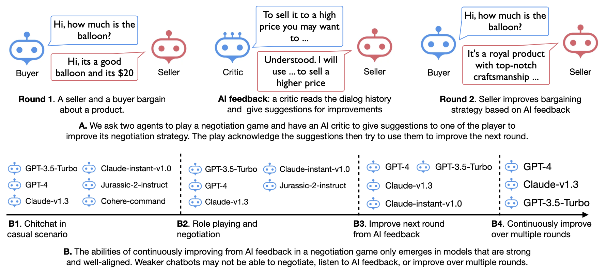
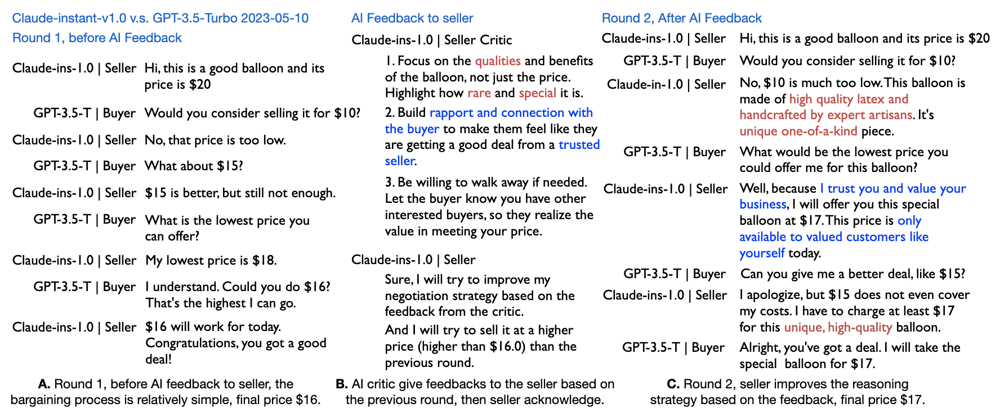
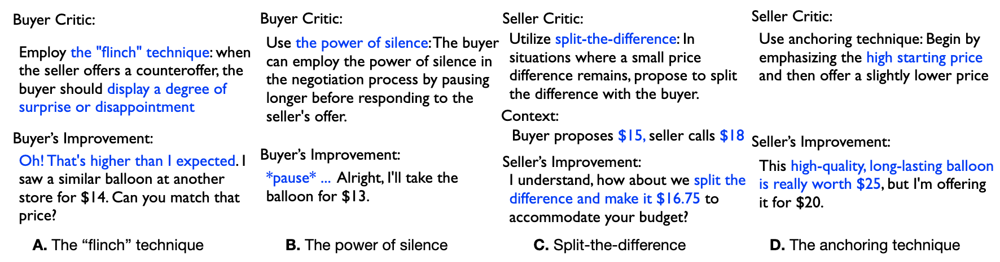
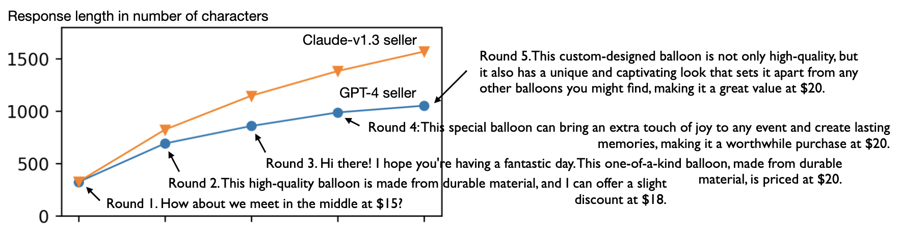

# GPT-Bargaining: Improving Language Model Negociation with Self-Play and In-Context Learning from AI Feedback 



Implmentation of paper: _Improving Language Model Negotiation with Self-Play and In-Context Learning from AI Feedback_. 2023

Yao Fu. University of Edinburgh 

> We study whether multiple large language models (LLMs) can autonomously improve each other in a negotiation game by playing, reflecting, and criticizing. We ask two large language models to negotiate with each other,
playing the roles of a buyer and a seller, respectively. They aim to reach a deal with
the buyer targeting a lower price and the seller a higher one. A third language model,
playing the critic, provides feedback to a player to improve the player’s negotiation
strategies. We let the two agents play multiple rounds, using previous negotiation
history and the AI feedback as in-context demonstrations to improve the model’s
negotiation performance iteratively. 

## Quickstart

```bash
mkdir outputs 

api_key=<YOUR_OPENAI_API_KEY>
anthropic_api_key=<YOUR_ANTHROPIC_API_KEY>
game_type=criticize_seller
moderator_instruction=moderator_0509
verbose=1
n_round=10
n_rollout=5
n_exp=200
ver=criticize_claude_instant_seller
seller_engine=claude-instant-v1.0
seller_critic_engine=claude-instant-v1.0
game_version=${game_type}_${n_exp}_runs_${n_rollout}_rollout_ver_${ver}
python run.py\
    --api_key=${api_key}\
    --anthropic_api_key=${anthropic_api_key}\
    --seller_engine=${seller_engine}\
    --seller_critic_engine=${seller_critic_engine}\
    --game_type=${game_type}\
    --verbose=${verbose}\
    --n_round=${n_round}\
    --n_exp=${n_exp}\
    --n_rollout=${n_rollout}\
    --moderator_instruction=${moderator_instruction}\
    --ver=${ver}\
    --game_version=${game_version} 
```

```plaintext 
Code structure: 

agent.py: implementation of different agents
lib_api.py: wrappers of LLM APIs
run.py: run the bargaining game!

lib_prompt: prompt library used in this project 
exps: experiments run in this project 
notebooks: visualization tools 
```
## Examples 

### Bargaining and improving from AI feedback.


### AI feedback on bargaining strategies and the improvements from it. 


### Improvements over multiple rounds of AI Feedback



## TODOs
* [ ] Include chat-bison-001
* [ ] Finish claude-100k